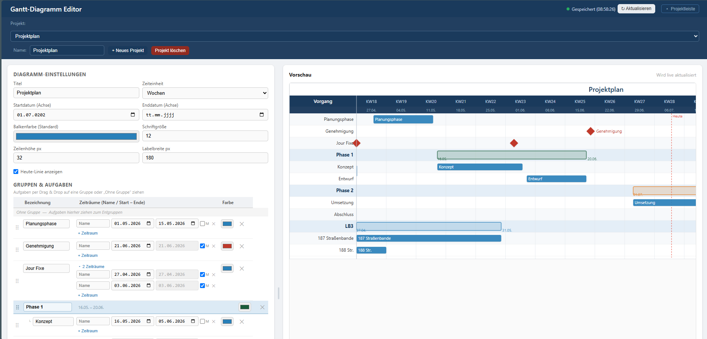

# Gantt Diagram Editor

This is a simple Gantt Diagram Editor that can be edited by multiple users simultaneously. It was mostly vibe coded.

## Features



- Add project task phases and deadlines
- Grouping tasks
- Show project timeline by days, weeks and months
- Customize colors and fonts
- Import as CSV
- Export as SVG and PNG
- User management with login and three roles

## Users and roles

Every page requires a login. There are three roles:

| Role | German label | Permissions |
| --- | --- | --- |
| `viewer` | Betrachter | View and export the chart |
| `editor` | Bearbeiter | Additionally edit projects, tasks and settings |
| `admin` | Admin | Additionally manage users at `/admin` |

Roles are enforced on the server, not only in the UI — a viewer receives `403` on
`POST /api/data` even when bypassing the interface.

### Initial admin account

The first admin is created from environment variables in `docker-compose.yml`,
but **only while no user exists yet**. Afterwards, further accounts are created
by an admin under `/admin`.

```yaml
environment:
  GANTT_ADMIN_USER: admin
  GANTT_ADMIN_PASSWORD: "at-least-10-characters"
```

The initial password must be changed on first login. Every account an admin
creates gets an initial password with the same forced change, and resetting a
password immediately invalidates that user's open sessions.

Keeping the password out of the compose file is described under
[Docker secrets](#docker-secrets).

## Configuration

All configuration is done through environment variables. Only
`GANTT_ADMIN_PASSWORD` is mandatory, and only for the very first start — every
other variable has a working default.

| Variable | Default | Purpose |
| --- | --- | --- |
| `GANTT_ADMIN_PASSWORD` | *(none)* | Password for the initial admin. Minimum 10 characters. **Required on first start** — the server refuses to start without it while no user exists. Ignored once any user exists. |
| `GANTT_ADMIN_USER` | `admin` | Username for the initial admin. Ignored once any user exists. |
| `GANTT_SECRET_KEY` | generated once, stored in the DB | Signs the session cookies. Set it explicitly when running several instances, otherwise each would sign with its own key and sessions would break on every request that lands elsewhere. Changing it logs everyone out. |
| `GANTT_COOKIE_SECURE` | `0` | Set to `1` when the app is reachable over HTTPS, so the session cookie is only ever sent encrypted. Leave at `0` for plain-HTTP setups — otherwise the browser withholds the cookie and login appears to silently fail. |
| `GANTT_TRUST_PROXY` | `0` | Set to `1` behind a reverse proxy (Traefik, nginx) so `X-Forwarded-*` headers are honoured and client IP and protocol are recorded correctly. Leave at `0` otherwise: without a proxy stripping them, a client could spoof its own address and scheme. |
| `GANTT_DB` | `gantt.db` | Path to the SQLite database file. |
| `GANTT_PORT` | `8000` | Port the server listens on. |

### Docker secrets

A password in a compose file is readable by anyone with access to the Docker
host via `docker inspect`. `GANTT_ADMIN_PASSWORD`, `GANTT_ADMIN_USER` and
`GANTT_SECRET_KEY` are therefore also read from a file when the variant with the
`_FILE` suffix is set:

```yaml
services:
  gantt:
    environment:
      GANTT_ADMIN_PASSWORD_FILE: /run/secrets/gantt_admin_password
    secrets:
      - gantt_admin_password

secrets:
  gantt_admin_password:
    file: ./secrets/gantt_admin_password.txt
```

The `_FILE` variant takes precedence over the plain variable, and surrounding
whitespace is stripped, so a trailing newline in the secrets file is harmless.
The remaining variables hold no secrets and are read from the environment only.

### Behind a reverse proxy

A typical setup terminating TLS at the proxy:

```yaml
environment:
  GANTT_COOKIE_SECURE: "1"
  GANTT_TRUST_PROXY: "1"
```

### Bind mount permissions

The container runs as UID 1000. With a bind mount such as `./gantt-data:/data`,
Docker creates the host directory as `root`, so the container cannot write to it
and startup fails. Either fix the ownership on the host:

```bash
mkdir -p ./gantt-data && sudo chown 1000:1000 ./gantt-data
```

…or use a named volume (`gantt-data:/data`), which inherits the correct
ownership from the image and avoids the problem entirely.

## Running locally

```bash
pip install -r requirements.txt
GANTT_ADMIN_PASSWORD="at-least-10-characters" python server.py
```

## To Do

- Rework of adding and editing tasks as it takes up too much space